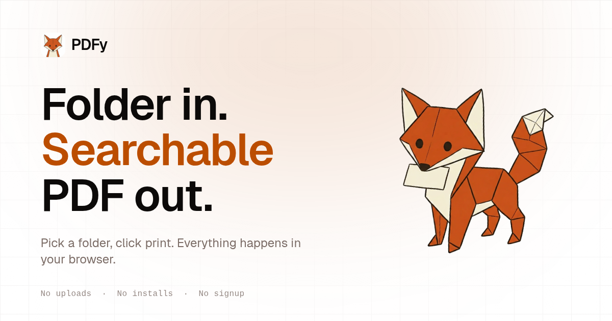

<p align="center">
  <a href="https://pdfy.oseifert.ch">
    
  </a>
</p>

# PDFy

Client-side SvelteKit app that turns a folder of source code into a single, clean,
text-based PDF with syntax highlighting. Pick a folder, tick the files, click print.
Everything happens in your browser. Nothing is uploaded.

**Live:** [pdfy.oseifert.ch](https://pdfy.oseifert.ch)

## Why

Many IDEs export code as huge image-rasterised PDFs: 100 MB+, no text selection, no Ctrl-F,
poor quality on print. PDFy produces real-text PDFs that stay searchable and copy-pasteable,
and it does it locally so your code never leaves your machine.

## What it does

- **Pick a folder** with the browser's File System Access API. The full tree shows up in a
  side panel; `.gitignore` rules are respected by default.
- **Compose a print plan**: drag files (or whole folders) from the tree into an ordered list.
  Each file is its own entry with optional custom title and per-section overrides. Same file
  can appear multiple times.
- **Cover page and table of contents** as first-class entries. Both editable in place. The TOC
  paginates across multiple sheets when the file list overflows.
- **Headers and footers** with six slots and Mustache-templated variables: `{{title}}`,
  `{{page}}`, `{{pages}}`, `{{path}}`, `{{date.iso}}`, `{{section}}`, etc.
- **Wrap-aware pagination** for code, so long lines split across visual rows without breaking
  line numbers.
- **Images and PDFs** in your folder get embedded; PDFs are rasterised page-by-page.
- **Live preview** sized to A4 or US Letter, with light or dark code themes (Shiki).
- **Recent projects** are remembered (IndexedDB) so you can come back without re-picking.
- **Smart-add** auto-selects the obvious files (README, source under `src/` or `lib/`, etc.)
  and learns which ones you reject.

The actual export uses your browser's native print dialog, which is why the PDFs stay
searchable and small.

## Browser support

Needs the **File System Access API**: Chrome, Edge, Brave, Opera, Arc, Vivaldi.
Firefox and Safari don't ship the API yet, so the editor route auto-bounces to an
unsupported page on those.

## Tech

- [SvelteKit](https://kit.svelte.dev/) with Svelte 5 runes
- [Tailwind CSS 4](https://tailwindcss.com/)
- [shadcn-svelte](https://www.shadcn-svelte.com/) + [bits-ui v2](https://bits-ui.com/)
- [Shiki](https://shiki.style/) for syntax highlighting
- [pdf.js](https://mozilla.github.io/pdf.js/) for embedded PDF rasterisation
- [Mustache](https://mustache.github.io/) for header / footer / TOC templating
- [idb](https://github.com/jakearchibald/idb) for IndexedDB persistence
- [Bun](https://bun.sh/) as the package manager and runtime
- Hosted on Vercel as a fully static site (zero serverless functions)

## Getting started

You need [Bun](https://bun.sh/) installed.

```bash
git clone https://github.com/ImGajeed76/pdfy.git
cd pdfy
bun install
bun run dev
```

The dev server starts on `http://localhost:5173`.

## Project layout

- `src/routes/` — SvelteKit pages (`/`, `/editor`, `/faq`, `/privacy`, `/unsupported`,
  `/dev/og` for previewing the Open Graph card)
- `src/lib/components/editor/` — three-pane editor shell (tree, plan, preview)
- `src/lib/editor/` — state, file-system access, smart-select, page estimation,
  templating, persistence
- `src/lib/site.ts` — site-wide constants (URL, name, tagline)
- `static/` — favicons, manifest, fox mascot art, sitemap, robots.txt
- `CLAUDE.md` — auto-loaded design rules for the AI coding assistant

## Privacy and analytics

Files never leave the browser. The site uses a **self-hosted, cookieless Plausible**
instance for aggregate page views and a couple of named events (`Open folder`, `Print`).
No personal data, no fingerprinting. Full disclosure on the
[privacy page](https://pdfy.oseifert.ch/privacy).

## Contributing

PRs welcome. Standard flow:

1. Fork
2. `git checkout -b feature/your-thing`
3. Run `bun run check` (Prettier, ESLint, svelte-check) before pushing
4. Open a PR

Style is enforced by the configs in the repo. Conventional Commits (`feat: ...`,
`fix: ...`, `chore: ...`) match the existing history.

## License

GPL v3.0. See [LICENSE](LICENSE).

---

<p align="center">
  
  <br />
  Made by <a href="https://oseifert.ch">Oliver Seifert</a>.
</p>
